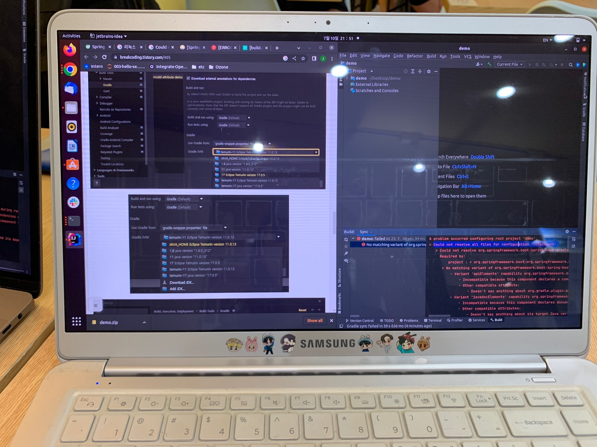

## Today I Learned
이라 쓰고 삽질 이야기
### Today Issue!
- OS: Linux 20.04
- JAVA: 11
- spring: 3.1.1
Java 11 setting부터 많이 고생하고, [spring initizlizr](https://start.spring.io/)를 이용해 Download 후 IntelliJ를 이용해 Open.
BUT! 오류 발생

#### WHY???
Spring 3.0 이후 부터는 JDK 17 버전부터 지원이 가능하다고 함...^_^

### Conclusion
JDK 17 설치 후 다시 확인할 것!
